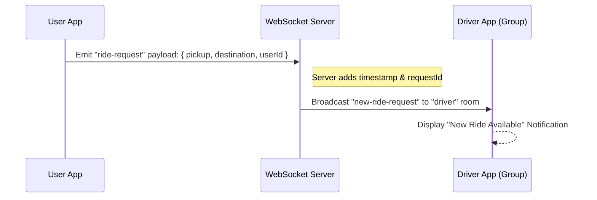
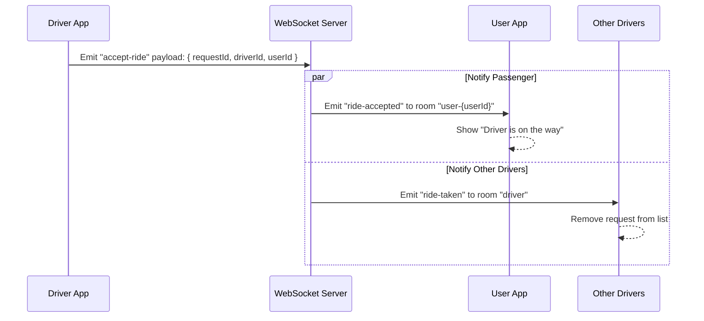
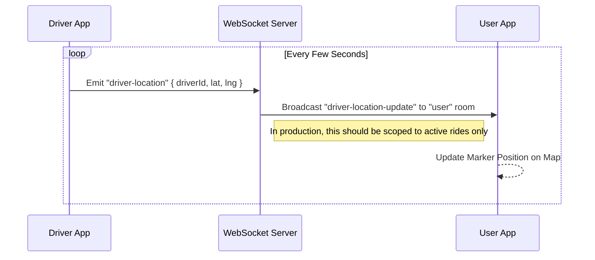
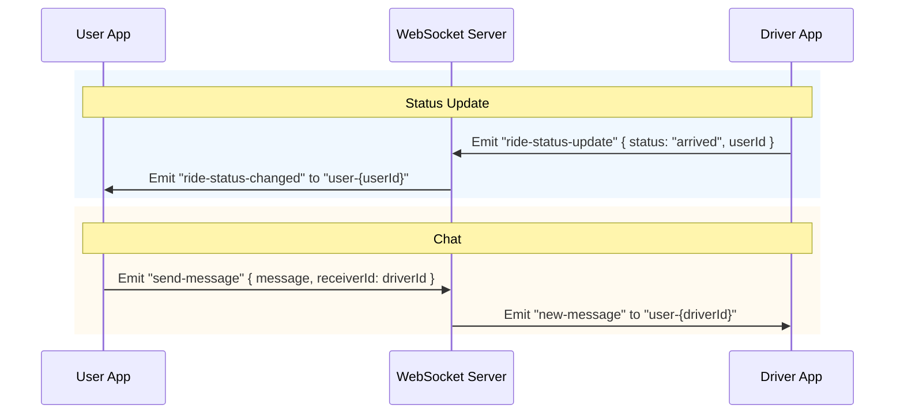

# WebSocket Communication Flow & Logic

This document outlines the real-time communication architecture between the User App, Driver App, and the WebSocket Server in the TaxiCity platform.

## Architecture Overview

The system uses a dedicated WebSocket Server (Socket.IO) to handle real-time events.

- **User App**: Connects as a client to request rides and track drivers.
- **Driver App**: Connects as a client to receive ride requests and broadcast location.
- **Backend API**: Sends events to the WebSocket server via an internal HTTP `/trigger` endpoint (protected by API Key).

## Authentication & Connection

### Client Connection (User/Driver App)

Clients authenticate using a Clerk session token.

1. **Client** connects to `WSS_URL`.
2. **Handshake**: Sends `token` (Clerk session token) and `role` ("user" | "driver") in auth payload/query.
3. **Server** verifies the token with Clerk.
    - If valid: Extracts `userId`.
    - Joins `user-{userId}` private room.
    - Joins `role` room (e.g., "driver" or "user"). (Note: "driver" room is used to broadcast new requests).

### Internal API Connection

The Next.js backend publishes events via HTTP to the WebSocket server.

1. **Backend** sends POST to `/trigger`.
2. **Headers**: Includes `x-api-key` (Internal Secret).
3. **Payload**: `{ channel, event, data }`.
4. **Server** validates key and broadcasts to the specified channel.

## Workflows & Logic

### 1. Ride Request Flow

**Scenario**: A passenger requests a ride.

### 2. Ride Acceptance Flow

**Scenario**: A driver accepts a pending request.

### 3. Live Driver Tracking Flow

**Scenario**: Driver is moving, and passenger sees the car on the map.

### 4. Status Updates & Messaging

**Scenario**: Ride status changes (e.g., Arrived, Completed) or Chat.

## Rooms & Channels Channels

| Channel / Room Name | Purpose                                                                                        | Access         |
| :------------------ | :--------------------------------------------------------------------------------------------- | :------------- |
| `user-{userId}`     | Private channel for specific user/driver. Used for direct notifications (Ride Accepted, Chat). | Private (Self) |
| `driver`            | Broadcast channel for all drivers. Used for new ride requests.                                 | Drivers Only   |
| `user`              | Broadcast channel for all users. Used for general updates (e.g., nearby drivers).              | Users Only     |

## Event API Reference

### Client -> Server Events

| Event Name           | Payload                                     | Description                          |
| :------------------- | :------------------------------------------ | :----------------------------------- |
| `ride-request`       | `{ pickup, destination, userId }`           | User requesting a vehicle.           |
| `accept-ride`        | `{ requestId, driverId, userId }`           | Driver accepting a request.          |
| `driver-location`    | `{ driverId, lat, lng }`                    | Frequent location updates.           |
| `ride-status-update` | `{ rideId, status, userId, driverId? }`     | Updates like 'started', 'completed'. |
| `send-message`       | `{ rideId, message, senderId, receiverId }` | In-ride chat.                        |
| `subscribe`          | `channelName`                               | Join a specific custom channel.      |
| `unsubscribe`        | `channelName`                               | Leave a custom channel.              |

### Server -> Client Events

| Event Name               | Target                | Description                         |
| :----------------------- | :-------------------- | :---------------------------------- |
| `new-ride-request`       | Room: `driver`        | Notification to drivers of new job. |
| `ride-accepted`          | Room: `user-{userId}` | Notify user their ride is accepted. |
| `ride-taken`             | Room: `driver`        | Tell other drivers the job is gone. |
| `driver-location-update` | Room: `user`          | Stream of driver coordinates.       |
| `ride-status-changed`    | Room: `user-{id}`     | Status change notification.         |
| `new-message`            | Room: `user-{id}`     | Incoming chat message.              |
